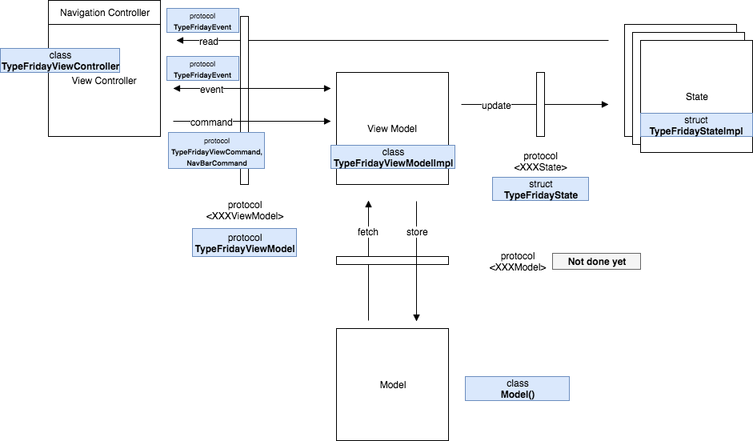

## Introduction

Very small application that apply a MVVM way to the 
[TypeFridayViewController](https://github.com/OnceApp/MVVMSkeleton/blob/master/MVVMSkeleton/TypeFriday/TypeFridayViewController.swift).  
This view controller present a textfield in which the user has to type a secret word (`Friday`).  
The completion label appears only when the user has typed more than 33% of the secret word.  
The done button is active only when the user has typed the word correctly.  

## TODO

- [ ] Add tests example
- [ ] Add the model protocol to abstract its implementation  

## Schema

  

